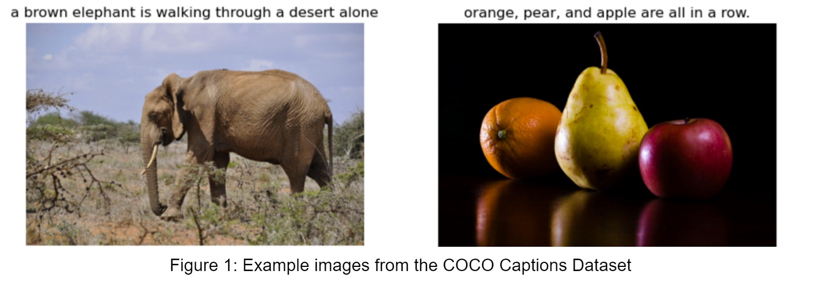
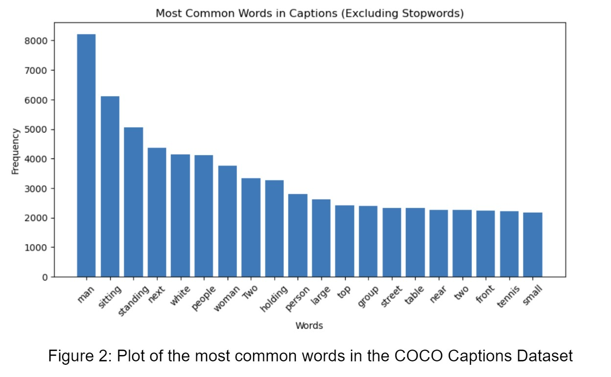

## DS 5500 Phase 1: Automatic Image Captioning

Many large databases with an abundance of image data suffer from the lack of sufficient labeling, resulting in the inability to optimally search and index its contents. For this project, we plan to develop an application capable of digesting an image and returning a descriptive textual caption to accurately label the image’s contents. Through this solution, we will significantly improve the ability for images in a database to gain visibility through text-based search, the ability to search a database with an image, and enhance the relevancy of results by providing more accurate and relevant searches. This application can be particularly beneficial for eCommerce platforms, where the volume of images is immense and proper labeling is crucial for efficient product discovery and customer satisfaction.

The model will employ an encoder-decoder architecture. In this architecture, the encoder is responsible for capturing meaningful representations from the image data, while the decoder generates coherent captions based on these representations. We will evaluate multiple transfer learning models for the encoder including common convolutional neural networks (CNN) and transformers. The decoder will be a long short-term memory network (LSTM) or transformer, facilitating the visual input into a descriptive textual output. In total, we will test four broad architectures: CNN & LSTM, CNN & Transformer, Transformer & LSTM, and Transformer & Transformer.

We’ve observed that several existing models have achieved significant results in automatic image captioning, corroborating the attainability of our project goals. In 2015 a model by Vinyals et al introduced the integration of pre-trained CNNs and LSTM networks for generating image captions, laying the foundation for subsequent research [1]. The field took a leap in advancement in 2017 with the introduction of transformer architectures capable of acting as the encoder or decoder, and new approaches such as Image Transformers have become a common component of image captioning. For example, this project will utilize VisualBert introduced by Li et al in 2019 as an image decoder [2]. Today, image captioning methods use a wide variety of techniques and architectures, and this project will compare the leading methods.

We will leverage the MS COCO Captions Dataset, which contains over one and a half million captions describing over 330,000 images [3]. The dataset’s images consist of many common items, animals, people, and vehicles in different situations with varying perspectives. All images in the dataset are associated with 1-5 corresponding captions that provide the ground-truth descriptions of its contents. Figure 1 displays samples of what appears in the dataset. 

There is no consistent theme throughout the COCO Captions Dataset’s images aside from depicting real, unaltered images with a main subject. Meaning we will not have any art (including paintings, drawings, etc.) or any blank/monochromatic images. To gain an understanding of the captions, Figure 2 shows a plot depicting the most frequent words in the captions database excluding common stopwords. This indicates the vast majority of images are of a person (man, people, woman, group) performing simple actions (sitting, standing, holding).

We evaluate the success of our project by using common metrics that grade machine-generated texts in comparison to gold standard translations, which in this case is our models' predicted captions to the human-made captions. We aimed to achieve a metric score grade equivalent to a “high quality translation” or greater, and were successful in achieving this goal. For reference, the BLEU (BiLingual Evaluation Understudy) Score grades on a range of 0 - 1 for language translation quality with 0.4 being “high quality translation” and we achieve a BLEU score of 0.658.

